# Grafo de Conocimiento Académico con GraphRAG

Una réplica académica a escala reducida del *People Knowledge Graph* de NASA, construida con **Neo4j**, **OpenAlex** y **Google Gemini**.

> Maestría en Big Data y Ciencia de Datos — Proyecto académico, 2026

El informe completo también está disponible en formato PDF: [`Informe_GraphRAG.pdf`](Informe_GraphRAG.pdf).

## Índice

1. [Introducción y motivación](#1-introducción-y-motivación)
2. [Marco conceptual](#2-marco-conceptual)
3. [Metodología](#3-metodología)
4. [Resultados](#4-resultados)
5. [Discusión y limitaciones metodológicas](#5-discusión-y-limitaciones-metodológicas)
6. [Conclusiones](#6-conclusiones)
7. [Cómo ejecutar el proyecto](#7-cómo-ejecutar-el-proyecto)
8. [Estructura del repositorio](#8-estructura-del-repositorio)
9. [Referencias](#9-referencias)

## 1. Introducción y motivación

Este proyecto replica, a escala académica, la iniciativa *"People Knowledge Graph"* desarrollada por el equipo de People Analytics de NASA, presentada públicamente en un community call organizado por Memgraph en abril de 2025. En dicha iniciativa, NASA construyó un grafo de conocimiento que conecta empleados, proyectos y habilidades para identificar expertos internos, detectar proyectos similares y responder preguntas organizacionales mediante un chatbot basado en GraphRAG (Graph Retrieval-Augmented Generation).

Dado que no se contaba con datos propios de una organización, se optó por construir un grafo análogo utilizando datos públicos y reales extraídos de [OpenAlex](https://openalex.org), un índice académico abierto y gratuito. El dominio elegido para la búsqueda fue *"inteligencia artificial aplicada a la exploración espacial"*, buscando mantener un paralelismo temático con el caso original de NASA.

El objetivo del proyecto no es realizar un estudio bibliométrico riguroso sobre exploración espacial, sino aprender de forma práctica el diseño de un grafo de conocimiento orientado a nodos en Neo4j y la implementación de un pipeline GraphRAG completo, incluyendo sus capacidades y limitaciones reales.

### 1.1 Objetivos

- Diseñar e implementar un grafo de conocimiento en Neo4j a partir de datos públicos reales.
- Replicar el patrón de modelado de NASA: nodos `Person`, `Project` y `Skill`, todos indexables bajo una etiqueta común (`Entity`).
- Calcular relaciones de similitud semántica entre proyectos mediante embeddings, análogo al uso de *cosine similarity* de NASA.
- Construir un pipeline GraphRAG funcional, combinando búsqueda vectorial y expansión de grafo con un LLM gratuito (Google Gemini).
- Evaluar críticamente las capacidades y limitaciones del sistema frente a distintos tipos de preguntas.

## 2. Marco conceptual

### 2.1 Embeddings

Un embedding es una representación numérica de un texto (una palabra, una oración, un párrafo) en forma de vector de N dimensiones, generada por un modelo de lenguaje entrenado para capturar el significado semántico del contenido. Dos textos con significados similares producen vectores cercanos entre sí en ese espacio N-dimensional, mientras que textos de significado distinto producen vectores alejados. Esta propiedad permite comparar textos por significado mediante operaciones matemáticas simples, como la similitud coseno, en lugar de comparar las palabras exactas que contienen.

En este proyecto se utilizó el modelo local y gratuito `all-MiniLM-L6-v2` (sentence-transformers) para generar embeddings de 384 dimensiones a partir de los títulos y descripciones de los proyectos, y de las preguntas realizadas al chatbot.

### 2.2 Bases de datos NoSQL orientadas a grafos

Las bases de datos NoSQL ("Not Only SQL") son sistemas de almacenamiento que no utilizan el modelo relacional clásico de tablas, filas y columnas, sino estructuras alternativas mejor adaptadas a ciertos tipos de datos. Existen varias familias: documentales (MongoDB), clave-valor (Redis), columnares (Cassandra) y orientadas a grafos (Neo4j, Memgraph), utilizada en este proyecto.

En una base de datos orientada a grafos, la información se modela como nodos (entidades, por ejemplo `Person` o `Project`) y relaciones (conexiones con dirección y, opcionalmente, propiedades propias, por ejemplo `WORKS_ON`). A diferencia de una base relacional, donde vincular información de múltiples tablas requiere operaciones JOIN cuyo costo crece con la profundidad de la consulta, en un grafo las relaciones están almacenadas físicamente junto a los nodos que conectan. Esto permite recorrer caminos de múltiples saltos (por ejemplo, persona → proyecto → habilidad → otro proyecto) con un rendimiento prácticamente constante, independiente de la cantidad total de datos almacenados. Esta característica es la que hace a Neo4j especialmente adecuado para preguntas del tipo *"¿quién tiene experiencia relacionada con X?"*, que en SQL requerirían múltiples JOIN costosos.

### 2.3 RAG (Retrieval-Augmented Generation)

RAG es una técnica que combina un modelo de lenguaje (LLM) con una fuente de datos externa, con el objetivo de que el modelo responda basándose en información verificable en lugar de depender únicamente de lo aprendido durante su entrenamiento. El flujo típico de RAG es:

1. La pregunta del usuario se convierte en un embedding.
2. Se busca en una base de datos vectorial los fragmentos de texto cuyo embedding sea más similar al de la pregunta.
3. Esos fragmentos se incluyen como contexto en el prompt enviado al LLM.
4. El LLM redacta una respuesta basada en ese contexto, reduciendo el riesgo de que invente información (alucinaciones).

El RAG tradicional recupera fragmentos de texto planos e independientes entre sí (por ejemplo, párrafos de distintos documentos), sin ninguna noción de cómo esos fragmentos se relacionan entre ellos.

### 2.4 GraphRAG

GraphRAG extiende el enfoque anterior reemplazando (o complementando) la base de datos vectorial de texto plano por un grafo de conocimiento. En lugar de recuperar fragmentos de texto aislados, el sistema recupera nodos relevantes del grafo y luego expande la búsqueda recorriendo sus relaciones directas, obteniendo *"tripletas de contexto"* (nodo – relación – nodo) que describen no solo el contenido de cada entidad, sino también cómo se conecta con otras.

Es el enfoque que utiliza NASA en su People Knowledge Graph, y el que se implementó en este proyecto: la búsqueda vectorial identifica los proyectos más relevantes semánticamente a la pregunta, y luego el grafo se expande un salto para incorporar las personas, habilidades, revistas y proyectos relacionados antes de generar la respuesta final.

### 2.5 ¿Por qué GraphRAG en lugar de RAG tradicional?

La diferencia central entre ambos enfoques es que el RAG tradicional responde bien preguntas sobre el contenido de un documento aislado, pero no puede responder preguntas que dependen de relaciones entre distintas entidades, ya que no tiene forma de representar ni recorrer esas conexiones. GraphRAG sí puede, porque la estructura de relaciones es parte constitutiva de los propios datos, no algo que deba inferirse del texto.

Ejemplos concretos observados en este proyecto que ilustran esta diferencia:

- Un RAG tradicional sobre los 150 papers como documentos aislados podría responder qué dice un paper puntual sobre IA en salud, pero no podría identificar que dos papers distintos están conectados por una relación de cita (`CITES`) ni que dos personas colaboraron porque ambas trabajaron en el mismo proyecto (`WORKS_ON`).
- En el caso de la pregunta hipotética sobre un equipo de IA explicable aplicada a diagnóstico médico ([sección 4.5.2](#452-casos-destacados-búsqueda-de-talento-para-necesidades-hipotéticas)), el sistema utilizó la relación `CITES` para identificar que un proyecto de oncología estaba citado directamente por el trabajo principal de XAI, y así fundamentar mejor la recomendación de personas a contactar. Esa conexión es estructural (existe en el grafo, no en el texto de un único documento) y por lo tanto invisible para un RAG tradicional basado solo en fragmentos de texto.
- El propio caso de NASA que motivó este proyecto surge de esta misma necesidad: encontrar expertos cuya conexión con un problema determinado no está expresada en un único documento, sino que emerge de atravesar varias relaciones (persona → proyectos → habilidades → proyectos similares).

En contrapartida, la [sección 4.5.3](#453-limitaciones-observadas-preguntas-de-agregación-global) documenta que GraphRAG no resuelve automáticamente todos los problemas: preguntas de agregación sobre la totalidad del grafo (*"¿quién participa en más proyectos?"*) siguen requiriendo consultas estructuradas directas (Cypher), ya que la búsqueda vectorial solo expone al modelo una porción local del grafo, no su totalidad.

## 3. Metodología

### 3.1 Fuente de datos

Se utilizó la API pública de [OpenAlex](https://openalex.org), un índice académico gratuito y sin necesidad de autenticación. Se realizó una búsqueda por texto libre con la consulta `"artificial intelligence space exploration"`, recuperando los primeros 150 resultados (*works*). Para cada resultado se extrajeron:

- Metadatos del trabajo (título, año, resumen reconstruido desde el índice invertido de OpenAlex).
- Autores (`authorships`), incluyendo su institución de afiliación cuando estaba disponible.
- Conceptos asociados (`concepts`), utilizados como proxy de habilidades (skills), filtrando aquellos con score de relevancia menor a 0.3.
- Fuente de publicación (`primary_location.source`), utilizada como nodo `Venue`.
- Referencias citadas (`referenced_works`), utilizadas para construir la relación `CITES` únicamente entre pares de trabajos que pertenecen ambos a la muestra de 150 papers.

### 3.2 Modelo de grafo

El esquema resultante refleja el mismo principio de modelado que NASA describió en su presentación: todos los nodos, independientemente de su tipo específico, comparten además la etiqueta genérica `Entity`, lo que permite construir un único índice vectorial que cubre la totalidad del grafo.

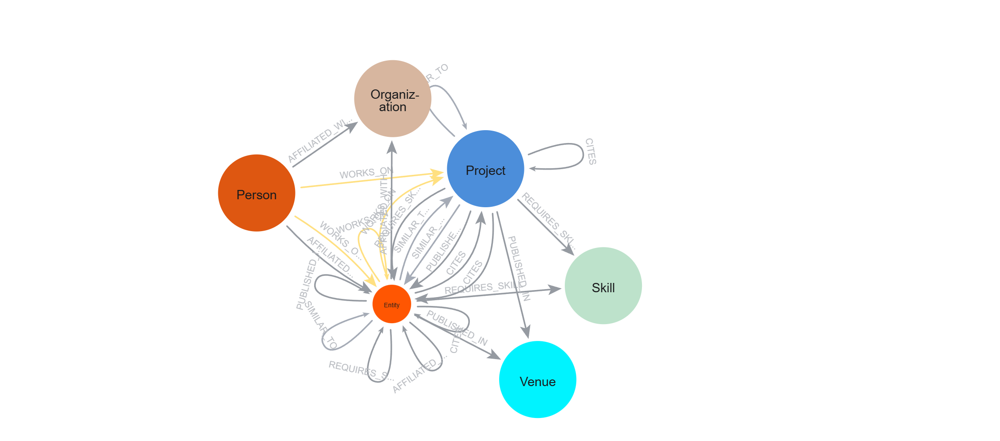
*Figura 1. Esquema del grafo generado con `CALL db.schema.visualization()` en Neo4j.*

Las entidades y relaciones del modelo son:

| Nodo | Origen del dato | Propiedades principales |
|---|---|---|
| `Person` | `authorships.author` | `person_id`, `name` |
| `Project` | work (paper) | `project_id`, `title`, `year`, `description`, `embedding` |
| `Skill` | `concepts` | `skill_id`, `name` |
| `Organization` | `authorships.institutions` | `org_id`, `name` |
| `Venue` | `primary_location.source` | `venue_id`, `name` |

| Relación | Desde → Hacia | Propiedad |
|---|---|---|
| `WORKS_ON` | Person → Project | — |
| `REQUIRES_SKILL` | Project → Skill | `score` |
| `AFFILIATED_WITH` | Person → Organization | — |
| `PUBLISHED_IN` | Project → Venue | — |
| `CITES` | Project → Project | — |
| `SIMILAR_TO` | Project → Project | `score` (cosine similarity) |

### 3.3 Carga de datos

La ingesta se realizó en dos etapas mediante scripts de Python. En la primera (`01_fetch_data.py`) se descargaron y transformaron los datos de OpenAlex a archivos CSV. En la segunda (`02_load_neo4j.py`) se cargaron a Neo4j mediante el driver oficial (bolt), utilizando sentencias `MERGE` en lotes de 500 registros para garantizar idempotencia y evitar duplicados, junto con constraints de unicidad sobre los identificadores de cada tipo de nodo.

### 3.4 Embeddings y similitud semántica

Siguiendo el mismo enfoque que NASA aplicó con *cosine similarity* entre descripciones de proyecto, se generaron embeddings de 384 dimensiones para cada nodo `Project` (a partir de título + descripción) utilizando el modelo local y gratuito `all-MiniLM-L6-v2` (sentence-transformers). Se calculó la similitud coseno entre todos los pares de proyectos, creando la relación `SIMILAR_TO` para aquellos pares que superaron un umbral de 0.75. Adicionalmente, se creó un índice vectorial en Neo4j (`entity_embeddings`) sobre la etiqueta `Entity`, habilitando búsqueda semántica mediante `db.index.vector.queryNodes`.

### 3.5 Arquitectura del chatbot GraphRAG

El pipeline replica el flujo descrito por NASA en cuatro etapas:

1. La pregunta del usuario se convierte en un embedding con el mismo modelo utilizado para los proyectos.
2. Se ejecuta una búsqueda vectorial ("pivot search") sobre el índice de Neo4j, recuperando los K nodos `Project` más similares semánticamente a la pregunta.
3. Se expande el grafo un salto desde cada nodo relevante, recolectando las relaciones vecinas (personas, skills, venues, citas y similitudes) como *"context triplets"*, en la misma terminología que emplea NASA.
4. Los triplets junto con la pregunta original se envían como contexto a un modelo de lenguaje (Google Gemini, vía Google AI Studio, plan gratuito), que redacta la respuesta final basándose exclusivamente en la información provista.

El parámetro `TOP_K`, que determina cuántos nodos trae la búsqueda vectorial inicial, resultó ser un factor determinante en el comportamiento del sistema, como se detalla en la sección de resultados y limitaciones.

## 4. Resultados

### 4.1 Volumen y composición del grafo

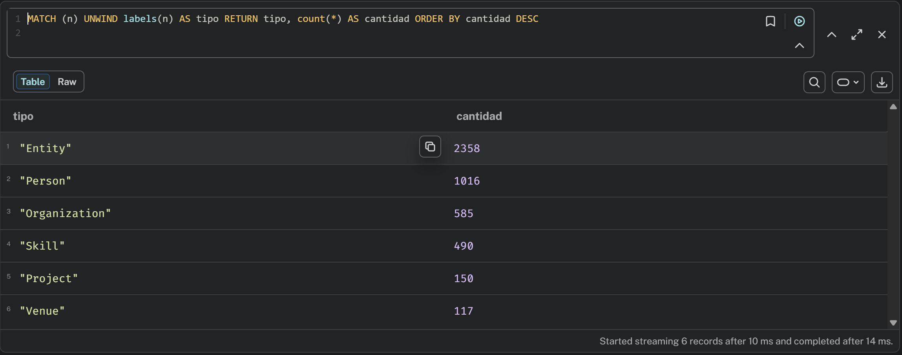
*Figura 2. Conteo de nodos por tipo de etiqueta.*

| Entidad | Cantidad |
|---|---|
| Person | 1016 |
| Organization | 585 |
| Skill | 490 |
| Project | 150 |
| Venue | 117 |
| **Total de nodos (Entity)** | **2358** |

En cuanto a relaciones, se cargaron **1043** `WORKS_ON`, **1314** `REQUIRES_SKILL`, **1490** `AFFILIATED_WITH`, **143** `PUBLISHED_IN`, **96** `CITES` y **13** `SIMILAR_TO`.

<table>
<tr>
<td>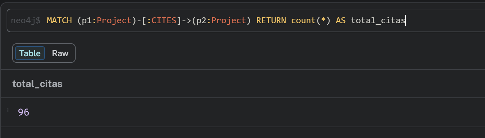</td>
<td>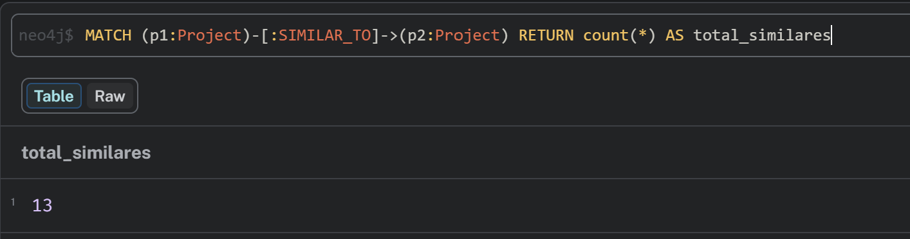</td>
</tr>
<tr>
<td align="center"><em>Figura 3. Verificación del total de relaciones CITES dentro de la muestra.</em></td>
<td align="center"><em>Figura 4. Verificación del total de relaciones SIMILAR_TO.</em></td>
</tr>
</table>

### 4.2 Distribución de cola larga en habilidades

Se observó una distribución de tipo *long-tail* (similar a la ley de Zipf) en la relación `REQUIRES_SKILL`: un número reducido de skills concentra la mayoría de las conexiones, mientras que la mayoría de los skills aparecen en uno o dos proyectos únicamente.

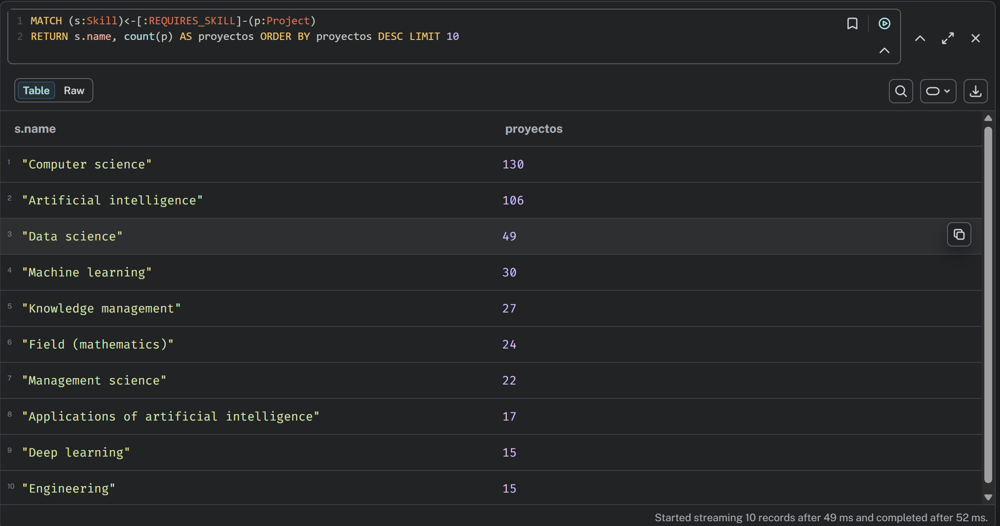
*Figura 5. Ranking de las 10 skills más repetidas entre proyectos.*

Este resultado también evidencia un sesgo de la muestra: dado que la búsqueda en OpenAlex se realizó por texto libre, los conceptos genéricos *"Computer science"* (130 proyectos) y *"Artificial intelligence"* (106 proyectos) dominan ampliamente, mientras que conceptos específicos aparecen con mucha menor frecuencia. Este fenómeno se retoma en la sección de [limitaciones](#5-discusión-y-limitaciones-metodológicas).

### 4.3 Validación de rankings estructurales

Se ejecutaron consultas Cypher de agregación directa para tener una referencia de verdad ("ground truth") contra la cual comparar las respuestas del chatbot GraphRAG.

<table>
<tr>
<td>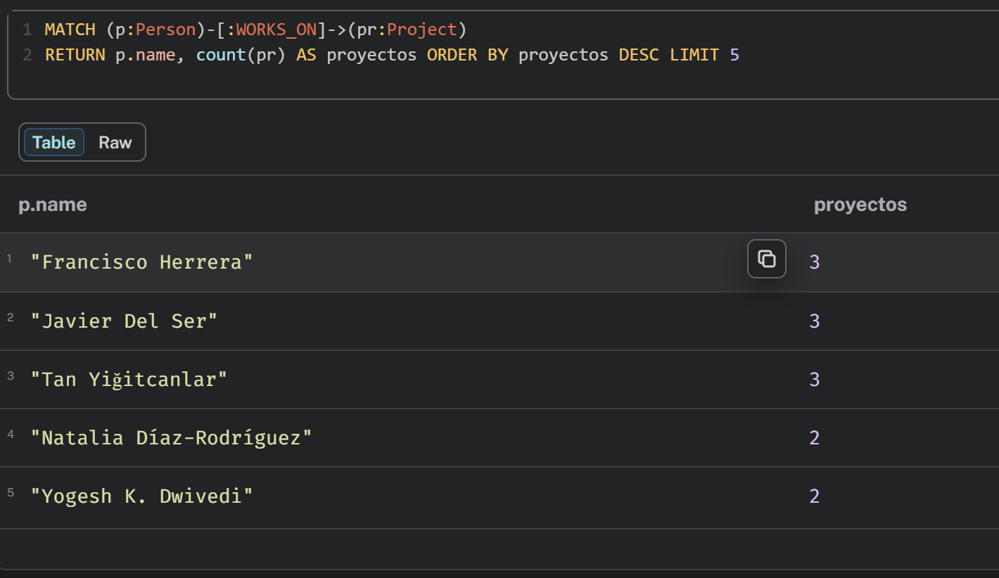</td>
<td>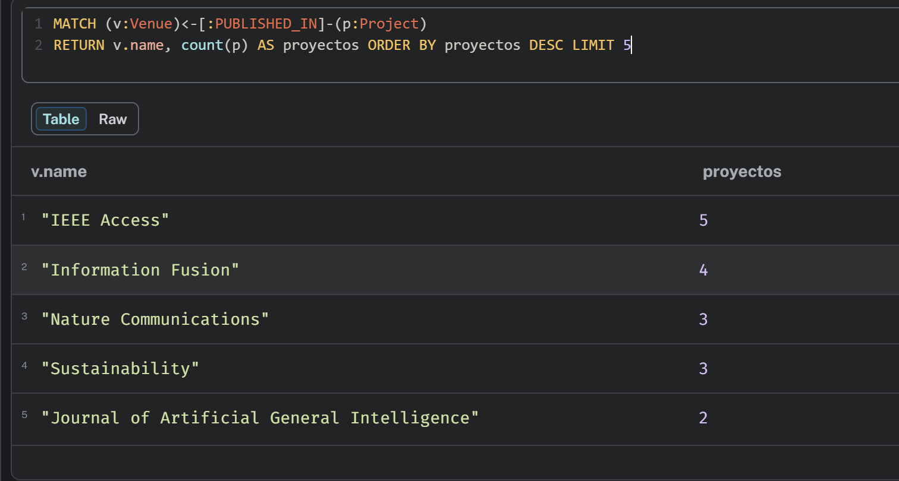</td>
</tr>
<tr>
<td align="center"><em>Figura 6. Personas con mayor cantidad de proyectos (consulta Cypher directa).</em></td>
<td align="center"><em>Figura 7. Revistas y conferencias (Venue) con más publicaciones asociadas.</em></td>
</tr>
</table>

### 4.4 Visualización del grafo en Neo4j Bloom

Se utilizó Neo4j Bloom (incluido gratuitamente con la licencia de desarrollo Enterprise de Neo4j Desktop) para explorar visualmente el grafo, asignando un color distinto a cada tipo de nodo.

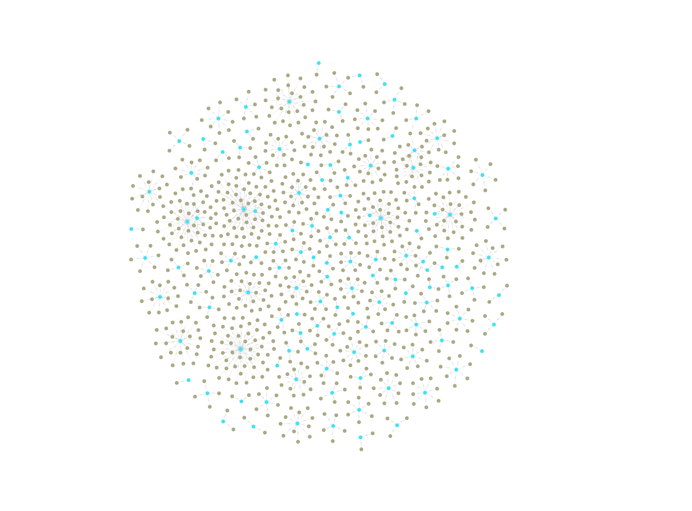
*Figura 8. Vista general de Person (oliva) conectados a Project (cian) mediante WORKS_ON. Se observan claramente proyectos con distinto grado de colaboración.*

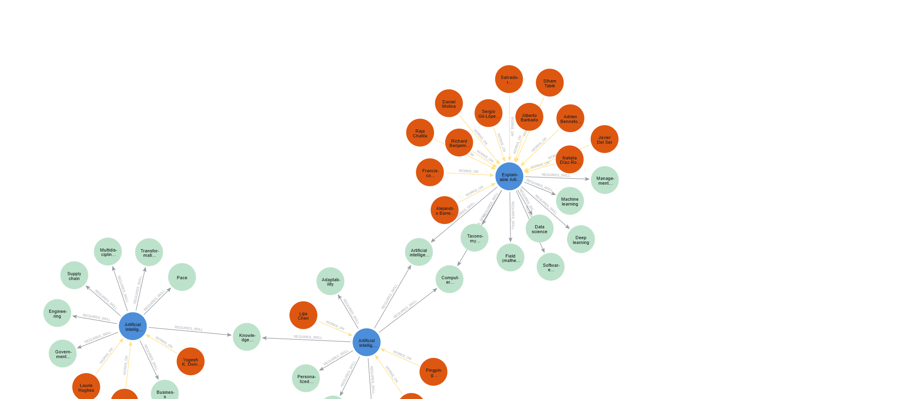
*Figura 9. Vista coloreada por tipo de nodo mostrando clusters temáticos (ej. Explainable AI) con sus autores y habilidades asociadas.*

### 4.5 Casos de uso del chatbot GraphRAG

A continuación se presentan los resultados obtenidos al interrogar al chatbot, organizados según el tipo de pregunta.

#### 4.5.1 Casos de éxito: preguntas temáticas

El sistema mostró un desempeño sólido ante preguntas de tipo temático/interpretativo, donde la búsqueda por similitud semántica es apropiada. La siguiente respuesta, ante la pregunta *"¿Qué proyectos aplican inteligencia artificial en el ámbito de la salud o medicina?"*, ilustra el comportamiento esperado: el sistema recuperó proyectos, personas y habilidades reales, sin introducir información no presente en el grafo.

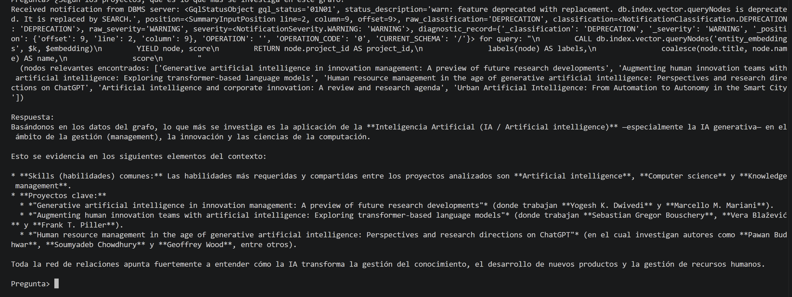
*Figura 10. Respuesta del chatbot ante una pregunta temática, citando proyectos, autores y skills reales del grafo.*

#### 4.5.2 Casos destacados: búsqueda de talento para necesidades hipotéticas

Se plantearon preguntas hipotéticas simulando el caso de uso principal que motivó a NASA a construir su People Graph: encontrar expertos internos para necesidades organizacionales nuevas. Ante la pregunta *"si tuviera que armar un equipo para desarrollar un nuevo combustible o propelente para cohetes espaciales, ¿qué personas del grafo tienen el perfil de habilidades más adecuado?"*, el sistema respondió de forma particularmente valiosa: reconoció explícitamente que no existían proyectos exactos sobre el tema, pero generalizó razonablemente hacia el perfil disponible más cercano (ciencia de materiales, nanotecnología, propiedades térmicas), agrupando personas reales por especialización.

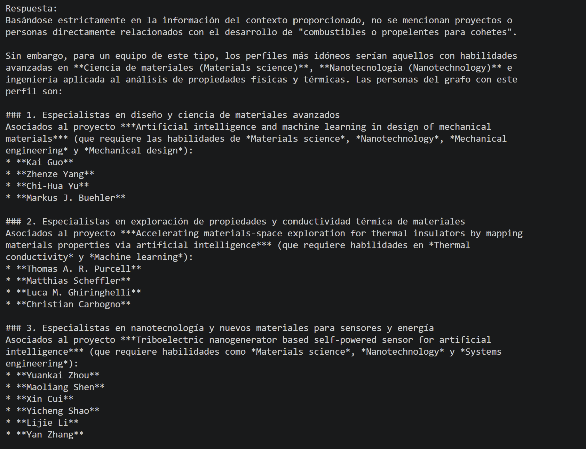
*Figura 11. El chatbot admite la ausencia de datos exactos y generaliza de forma honesta hacia el perfil más cercano disponible.*

En una segunda pregunta hipotética sobre un equipo de IA explicable (XAI) aplicada a diagnóstico médico, el sistema fue un paso más allá: utilizó la relación `CITES` del grafo para identificar que un proyecto de oncología estaba citado directamente por el trabajo principal de XAI, empleando así la estructura de conexiones del grafo —y no solo la similitud semántica— para fundamentar mejor su recomendación.

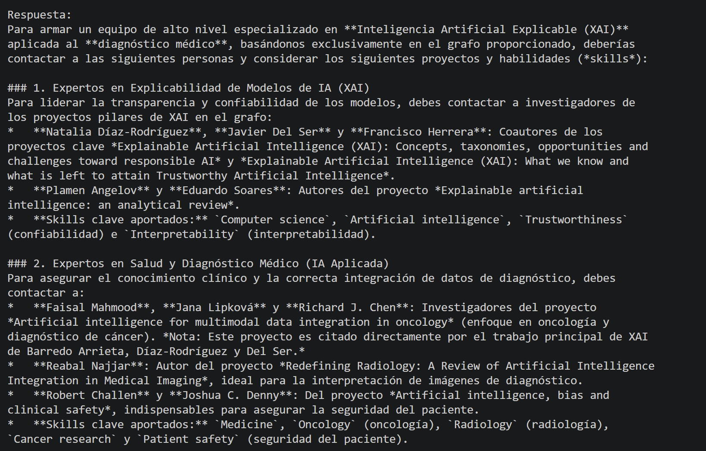
*Figura 12. El chatbot combina búsqueda semántica y estructura del grafo (relación CITES) para justificar su recomendación.*

#### 4.5.3 Limitaciones observadas: preguntas de agregación global

El sistema mostró una limitación estructural clara ante preguntas que requieren agregación sobre la totalidad del grafo (por ejemplo, *"¿qué persona participa en más proyectos?"*). Con la configuración por defecto (`TOP_K=5`), el chatbot solo tiene visibilidad de un vecindario reducido del grafo, por lo que generaliza incorrectamente una conclusión local ("nadie repite proyecto") como si fuera válida para el grafo completo.

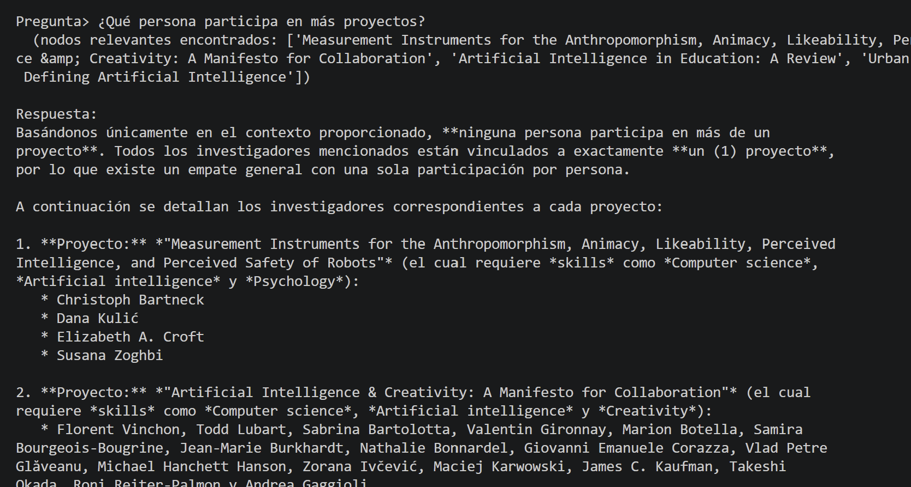
*Figura 13. Con TOP_K=5, el chatbot concluye erróneamente que ninguna persona participa en más de un proyecto, al ver solo una muestra parcial del grafo.*

Es importante notar que esta no es una alucinación en el sentido clásico (el modelo no inventó datos falsos): el razonamiento sobre los 5 proyectos recibidos como contexto fue correcto. El error es de generalización indebida desde una muestra parcial hacia una conclusión global, producto del diseño mismo de la arquitectura RAG.

Al incrementar `TOP_K` a 150 (esencialmente el total de proyectos del grafo), el sistema sí logró identificar correctamente a las tres personas con mayor participación (3 proyectos cada una), coincidiendo exactamente con la consulta Cypher de referencia (Figura 6).

Este hallazgo evidencia un trade-off central en el diseño de sistemas RAG: un `TOP_K` reducido es eficiente pero ciego a patrones globales, mientras que un `TOP_K` elevado recupera precisión a costa de perder la eficiencia que constituye la razón de ser del enfoque RAG frente a simplemente enviar todo el dataset al modelo. En un grafo de la escala que maneja NASA (proyectando más de 500.000 nodos), esta segunda estrategia no sería viable.

Se identificó además una segunda limitación, independiente de `TOP_K`: la función de expansión de contexto solo recorre un salto de distancia desde cada proyecto relevante. Esto implica que entidades a dos saltos, como `Organization` (Project → Person → Organization), quedan fuera del contexto sin importar cuán alto sea `TOP_K`, ya que la limitación no es de cobertura de nodos sino de profundidad de expansión del grafo.

#### 4.5.4 Consultas favorecidas por un contexto amplio

Con `TOP_K=150`, el sistema demostró buen desempeño identificando patrones que sí están a un salto de distancia, como las relaciones `PUBLISHED_IN`, `CITES` y `SIMILAR_TO`, superando ampliamente a la configuración por defecto:

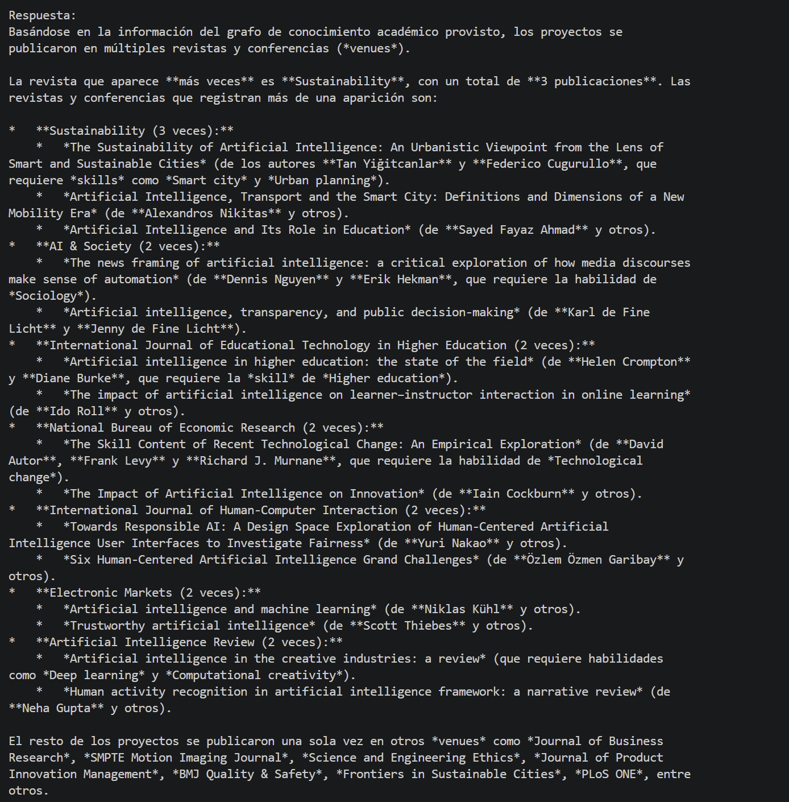
*Figura 14. Con TOP_K=150, el chatbot identifica correctamente la revista con más publicaciones asociadas (Sustainability, 3 veces), coincidiendo con la consulta Cypher de referencia.*

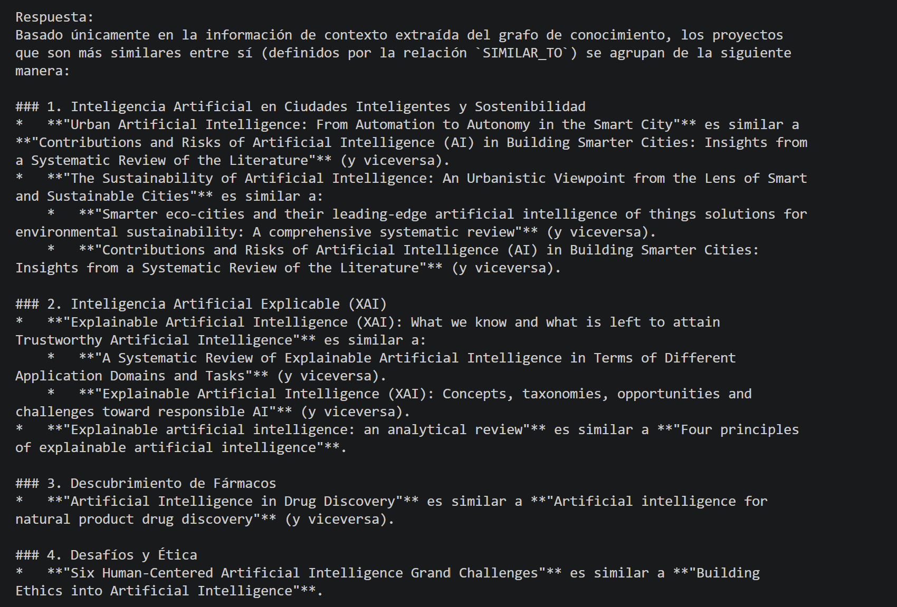
*Figura 15. El chatbot no solo listó los 13 pares de SIMILAR_TO correctamente, sino que los agrupó en clusters temáticos de forma espontánea (ciudades inteligentes, XAI, descubrimiento de fármacos, ética).*

## 5. Discusión y limitaciones metodológicas

### 5.1 Ruido temático en la búsqueda por texto libre

Al analizar manualmente los 150 títulos recuperados, se determinó que solo aproximadamente 6 papers (4% de la muestra) están genuinamente relacionados con exploración espacial. El resto corresponde a inteligencia artificial aplicada a dominios muy diversos (educación, salud, manufactura, ciudades inteligentes, ética, entre otros), incluidos por coincidencia léxica de la palabra *"space"* en sentidos no relacionados (*design space*, *chemical space*, *vector space*, *materials-space*).

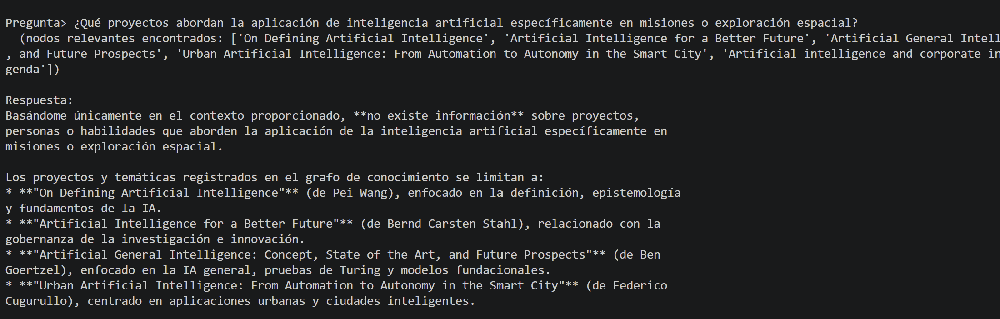
*Figura 16. Ante una pregunta sobre exploración espacial, el chatbot reconoce honestamente que el contexto recuperado no corresponde al tema solicitado, en lugar de inventar una respuesta.*

Este hallazgo es consistente con las limitaciones que el propio equipo de NASA reportó en su presentación respecto a la necesidad de mejorar la calidad y desambiguación de los datos extraídos automáticamente (por ejemplo, mapear "JS" a "JavaScript"). En nuestro caso, el problema análogo sería mapear apariciones de *"space"* a su sentido correcto según el contexto. Una mejora futura consistiría en filtrar por el campo `concepts` de OpenAlex en lugar de texto libre, combinando conceptos como *"Aerospace engineering"* o *"Astronautics"* junto con *"Artificial intelligence"*.

Cabe destacar un hallazgo positivo dentro de este ruido: los dos papers más claramente relacionados con exploración espacial dentro de la muestra (*"The Role of Artificial Intelligence In Space Exploration"* y *"Using Artificial Intelligence for Space Challenges: A Survey"*) se citan mutuamente, sugiriendo que, pese al ruido general, el grafo logró capturar al menos una conexión temáticamente correcta.

### 5.2 Sesgo de conceptos genéricos

Al preguntar *"¿qué es lo que más se investiga en este grafo?"*, el sistema respondió, de forma correcta pero poco informativa, que el tema dominante es la inteligencia artificial. Esto es una consecuencia directa y esperable del sesgo de selección de la muestra (la propia búsqueda fue por ese término), no un error del pipeline. Se documenta como ejemplo de cómo un sistema de recuperación de información puede producir respuestas técnicamente correctas pero de bajo valor informativo cuando el dataset subyacente está sesgado.

### 5.3 Comparación entre GraphRAG y consultas estructuradas (Cypher)

La experimentación permitió establecer una distinción clara sobre cuándo cada enfoque resulta más adecuado:

| Tipo de pregunta | Herramienta recomendada | Motivo |
|---|---|---|
| Temática / interpretativa ("¿qué proyectos tratan sobre X?") | GraphRAG | Requiere similitud semántica y síntesis en lenguaje natural |
| Agregación global ("¿quién participa en más proyectos?") | Cypher directo | Requiere recorrer la totalidad del grafo, no una muestra |
| Búsqueda de talento con criterios múltiples | GraphRAG | Se beneficia de razonamiento sobre estructura + lenguaje natural |
| Conteos y rankings exactos | Cypher directo | Cypher garantiza exactitud; el LLM puede generalizar mal |

Esta distinción sugiere que una arquitectura de producción robusta debería combinar ambos enfoques (a veces denominado *"agentic RAG"* o *"text-to-Cypher + RAG"*), detectando automáticamente el tipo de pregunta y enrutándola hacia la herramienta adecuada — mejora que el propio equipo de NASA identificó como trabajo futuro en su presentación.

## 6. Conclusiones

El proyecto logró replicar, a escala académica y con datos 100% públicos, los elementos centrales del People Knowledge Graph de NASA: un grafo de conocimiento orientado a nodos en Neo4j, cálculo de similitud semántica entre proyectos, y un chatbot GraphRAG funcional sobre una arquitectura gratuita (OpenAlex + sentence-transformers local + Google Gemini).

Más allá de la implementación técnica, el proyecto permitió identificar de forma empírica las fortalezas y limitaciones reales de un sistema GraphRAG: buen desempeño en preguntas temáticas y de búsqueda de talento con razonamiento sobre estructura de grafo, y limitaciones claras en preguntas de agregación global, cuya causa raíz (visibilidad parcial del grafo mediante búsqueda vectorial local) resulta ilustrativa de un problema de diseño general en sistemas RAG, no exclusivo de esta implementación.

Finalmente, el proceso evidenció la importancia de la calidad de los datos de entrada: un sesgo aparentemente menor en la estrategia de búsqueda (texto libre vs. filtrado por conceptos) tuvo un impacto significativo en la relevancia temática de la muestra final, un aprendizaje metodológico válido más allá del alcance específico de este proyecto.

## 7. Cómo ejecutar el proyecto

### Instalación

```bash
git clone https://github.com/jcserna/graphrag-project.git
cd graphrag-project
python -m venv .venv
.venv\Scripts\activate        # Windows
pip install -r requirements.txt
```

Requiere una instancia de Neo4j corriendo localmente (por ejemplo, Neo4j Desktop) con soporte de índices vectoriales.

### Credenciales

Copiar `.env.example` a `.env` y completar con tus propios valores:

```bash
copy .env.example .env
```

```
NEO4J_URI=bolt://localhost:7687
NEO4J_USER=neo4j
NEO4J_PASSWORD=tu_contraseña
GEMINI_API_KEY=tu_api_key       # gratis en https://aistudio.google.com/app/apikey
```

`.env` está excluido del repositorio vía `.gitignore` — nunca subir credenciales reales.

### Ejecución del pipeline

```bash
python 01_fetch_data.py            # descarga datos de OpenAlex a data/
python 02_load_neo4j.py            # carga el grafo en Neo4j
python 03_embeddings_similarity.py # embeddings, SIMILAR_TO e índice vectorial
python 04_graphrag_chatbot.py      # chatbot interactivo por consola
```

## 8. Estructura del repositorio

```
graphrag-project/
├── 01_fetch_data.py              # descarga y transforma datos de OpenAlex
├── 02_load_neo4j.py               # carga el grafo a Neo4j
├── 03_embeddings_similarity.py    # embeddings, similitud coseno, índice vectorial
├── 04_graphrag_chatbot.py         # chatbot GraphRAG interactivo
├── requirements.txt
├── .env.example
├── data/                          # CSVs generados por 01_fetch_data.py
├── images/                        # figuras del informe (fig01 a fig16)
└── Informe_GraphRAG.pdf           # informe completo
```

## 9. Referencias

- Tasneem, S. (2025). *How NASA is Using Graph Technology and LLMs to Build a People Knowledge Graph*. Memgraph Blog. https://memgraph.com/blog/nasa-memgraph-people-knowledge-graph
- OpenAlex. Índice académico abierto. https://openalex.org
- Neo4j Graph Database & Analytics. https://neo4j.com
- Reimers, N. & Gurevych, I. Sentence-Transformers (`all-MiniLM-L6-v2`). https://www.sbert.net
- Google AI Studio / Gemini API. https://aistudio.google.com
